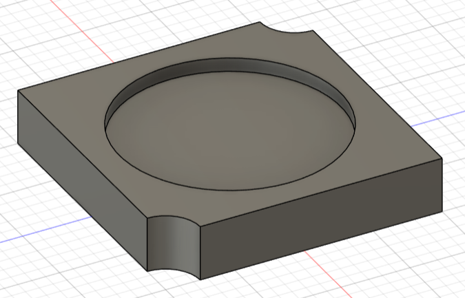
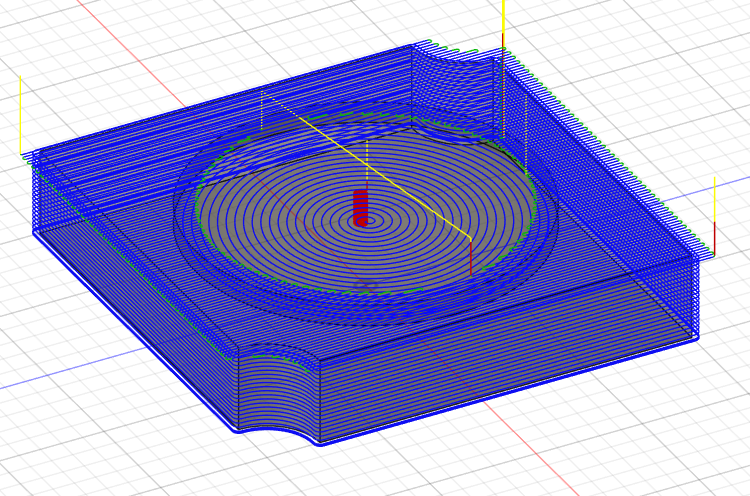

# Fusion 360 CNC CAM Practice

This repository contains my CNC CAM learning projects in Fusion 360.

## Projects

### Project 01 — Face / Pocket / Contour
- Basic CAM operations
- Conservative parameters for safe learning
- Full toolpath simulation

# Fusion 360 CNC CAM Practice

### Model

### Toolpath Simulation

 [Open project notes](project-01-face-pocket-contour/notes.md)

## Focus
- Understanding CAM parameters
- Safe toolpaths
- Avoiding tool breakage during learning
